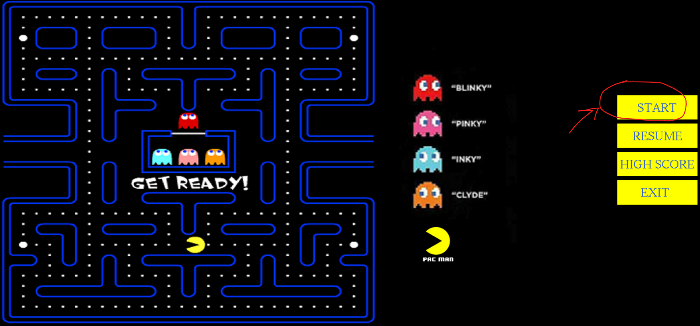
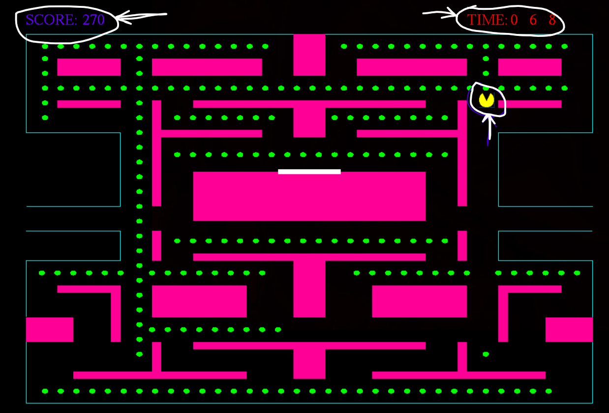
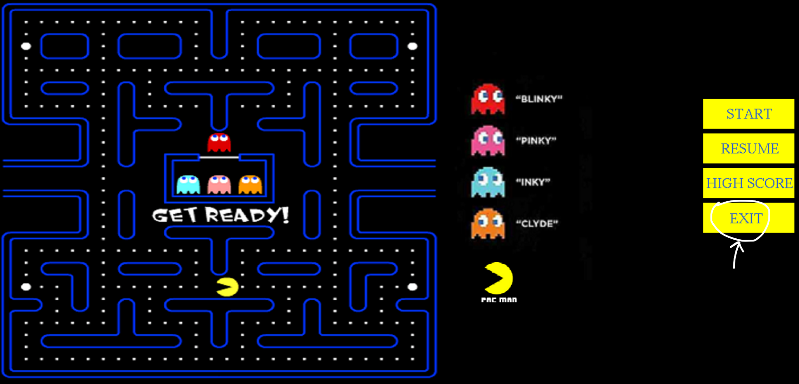

# IGraphics Final Project - Pacman

Contains code for the Pacman game built using IGraphics, a c++ wrapper libray.

## Tech Stack

**Programming Language:** C, C++

**Library:** IGraphics

## Run in codeblocks
- Follow the instructions in the file [Solving iGraphichs project related issues in Codeblocks.pdf](https://drive.google.com/file/d/19sG4_nOUeBvJxjewzitg7s-DL4An0Ji0/view?usp=drive_link) in order to setup the compiler in codeblocks
- Create a new project using codeblocks by clicking on the **Open an existing project** link in the middle of the start screen
- Select the **.cbp** file (codeblocks project) by double clicking on it from the popup window
- Right click on the project name **IGraphics** from the project tree on the left of the codeblocks UI, click on **Add files** and add the file named **Final_asgn.cpp**
- The files that are needed to run the project are starred in **Project Structure** section, you may need to add them to the project in the same way as well (rest of the files are for demo purposes).
- Click on the START button to start the game. 
  
- Use arrow keys to move pacman to naviate through the maze and consume as many dots as possible to get the highest point. The time and points consumed are shown on top of the screen.
  
- Click on the EXIT button to exit the game
  
  

## Project Structure

```bash
C:.
│   .gitignore
│   BallDemo.cpp
│   BgCoordinates.h*
│   black bgd.bmp*
│   Blinky 1.bmp*
│   Blinky 2.bmp*
│   Blinky 3.bmp*
│   Blinky 4.bmp*
│   Blinky 5.bmp*
│   Blinky 6.bmp*
│   Blinky 7.bmp*
│   Blinky 8.bmp*
│   check_left_bound.h*
│   check_low_bound.h*
│   check_right_bound.h*
│   check_up_bound.h*
│   Final asgn.cpp*
│   IGraphics.cbp*
│   IGraphics.depend
│   iGraphics.h*
│   IGraphics.layout
│   iMain.cpp
│   MouseDemo.cpp
│   pacman down 1.bmp*
│   pacman down 2.bmp*
│   pacman down 3.bmp*
│   pacman left 1.bmp*
│   pacman left 2.bmp*
│   pacman left 3.bmp*
│   pacman right 1.bmp*
│   pacman right 2.bmp*
│   pacman right 3.bmp*
│   pacman start screen.bmp*
│   pacman start screen_2.bmp*
│   pacman start screen_3.bmp*
│   pacman up 1.bmp*
│   pacman up 2.bmp*
│   pacman up 3.bmp*
│   PictureDemo.cpp
│   README.md
│   SolarSystem.cpp
│   TextInputDemo.cpp
│   watch.cpp
│   wheel.bmp
│
├───bin
│   └───Debug
│           glut32.dll
│           OpenGL.exe
│
├───obj
│   └───Debug
│           Final asgn.o
│
└───OpenGL
    ├───dll
    │       glu32.dll
    │       glut32.dll
    │       opengl32.dll
    │
    ├───include
    │       GL.H
    │       GLAux.h
    │       GLU.H
    │       glui.h
    │       glut.h
    │
    └───lib
            Glaux.lib
            GLU32.LIB
            glui32.lib
            glut32.lib
            OPENGL32.LIB
```
## Authors

- [Sheikh Intiser Uddin Dipta](https://github.com/sheikhDipta003)


## Acknowledgements
 - [Class recording on IGraphics](https://drive.google.com/file/d/1GCcOolvL5-7VL-Qydna8IV-ovv1U7tVK/view?usp=drive_link)
 - [iGraphics Tutorial in Bangla](https://youtube.com/playlist?list=PLKiZXxQe7OiDVNhkwgGZ6A6xW-zMbnSXb&si=AupD_d5SPIGKBhZO)